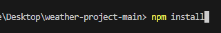
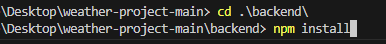
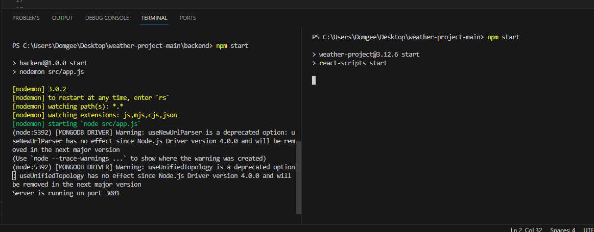
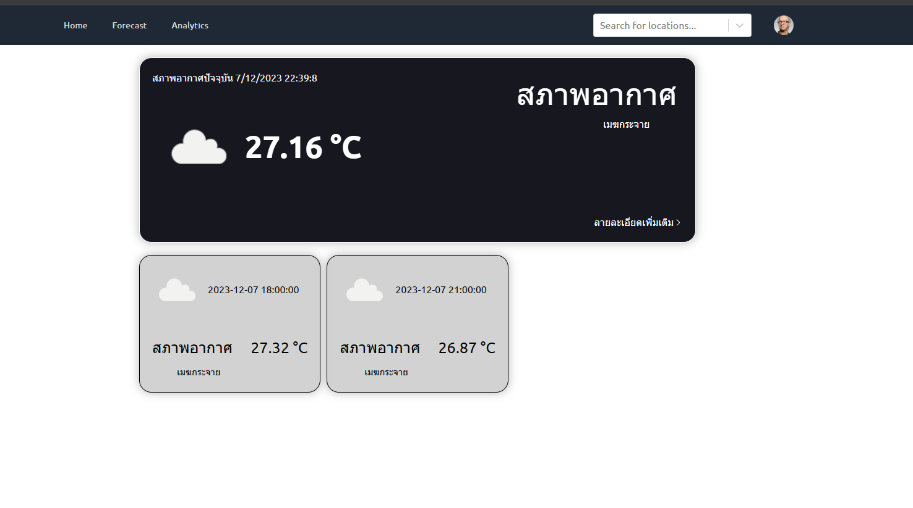

## This is a project during my studies that I developed with my friends, where I am responsible for creating an environment for the team to work together.

# Getting Started Weather-project

## วิธีการเริ่มต้น

เพื่อใช้งาน Weather-project กรุณาทำตามขั้นตอนนี้:

### Frontend

1. เข้าไปที่โฟลเดอร์ `Weather-project-main` 
2. เปิด Terminal และพิมพ์คำสั่งต่อไปนี้เพื่อติดตั้ง dependencies ที่จำเป็น:

   
    ```bash
    npm install
    ```

3. เมื่อการติดตั้งเสร็จสมบูรณ์ ให้เริ่ม frontend โดยใช้คำสั่ง:

    ```bash
    npm start
    ```

   นี้จะเปิดเว็บไซต์.

### Backend

1. เปลี่ยนไปที่ไดเรกทอรี `backend`:

    ```bash
    cd backend
    ```

2. ใช้คำสั่งต่อไปนี้เพื่อติดตั้ง dependencies ของ backend:

    ```bash
    npm install
    ```
   

3. เริ่ม backend server:

    ```bash
    npm start
    ```

   ตอนนี้ backend server กำลังทำงาน.


**หมายเหตุ:**
ระบบมีการจำกัดการเข้าถึงบางฟังก์ชัน เช่น Forecast และ Analytic ที่ผู้ใช้จำเป็นต้องเข้าสู่ระบบ (Login) เพื่อใช้งาน หากคุณยังไม่มีบัญชี คุณสามารถทำการลงทะเบียน (Register) ก่อนที่จะใช้บริการดังกล่าวได้งับ

**ข้อมูลการเข้าใช้:**
- ชื่อผู้ใช้ (Username): test01
- รหัสผ่าน (Password): 12345678

หากคุณต้องการทดลองใช้งานทันที คุณสามารถใช้ข้อมูลการเข้าใช้ดังกล่าวได้เลยคอฟ!

## ตัวอย่าง

นี่คือตัวอย่างของโปรเจค:





